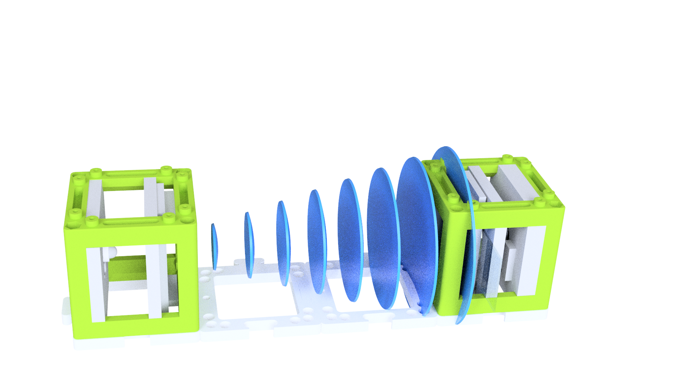
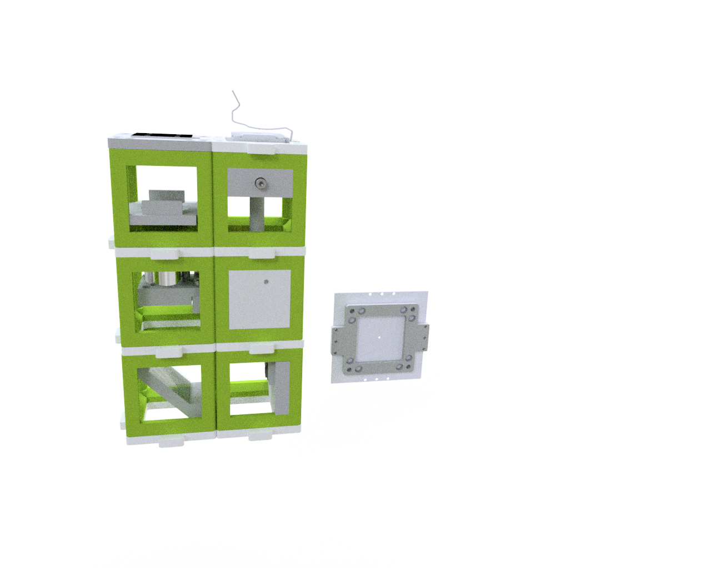
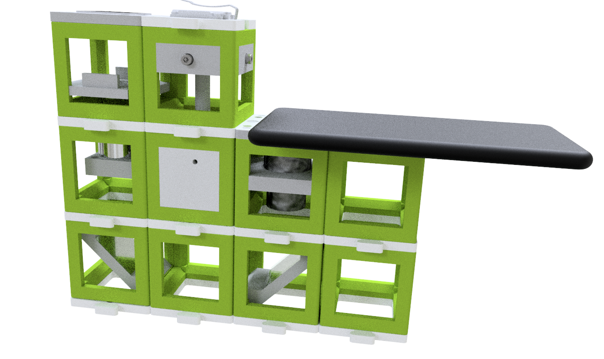

# UC2 Cheatsheet
---

## Resources

* **TUTORIALS** From a **beginner** to a **professional? This way https://github.com/openUC2/UC2-GIT/tree/master/TUTORIALS
* **Video:** A recent *MITI RTMFM* **YouTube** seminar describes the current state of the UC2 system [here](https://www.youtube.com/watch?v=Jp5TOqvf7Nc&ab_channel=mitirtmfm).
* **Paper**: The UC2 paper on Nat. Comm. is [open access](https://go.nature.com/3q3xQFM)
* **General openUC2 repository** with all kinds of cube-related projects https://github.com/openUC2/
* **Electronics**:
  * Early-phase UC2 electronics module: https://github.com/openUC2/UC2_Feather
  * The Firmware for the ESP's and a python client is provided https://github.com/openUC2/UC2-REST
* **Software:**
  * [I2K ImSwitch Talk by Xavier](https://www.youtube.com/watch?v=XsbnMkGSPQQ)
  * [I2K ImSwtich+Uc2 Workshop](https://www.youtube.com/watch?v=7f1XH7lQcgQ&t=3410s)
  * *ImSwitch for UC2* can be found [here](https://github.com/beniroquai/ImSwitch) (*forked version*)
  * UC2-related setup configurations for ImSwitch can be found [here](https://github.com/beniroquai/ImSwitchConfig/)

## Social Media

A list of tutorials on how to assemble, design and play with cubes. ([YouTube](https://www.youtube.com/channel/UCcHFzXTdC1Ro0OMnHS_54UA))

Random post about cool-stuff optics ([Twitter @openUC2](https://github.com/openUC2/))

## Learning Resources and general Repository structure

The main openUC2 repository ([**GitHub**](https://github.com/openUC2/UC2-GIT))

An extended list of [**Tutorials**](https://github.com/openUC2/UC2-GIT/tree/master/TUTORIALS) for beginners and professionals can be found inside the main GitHub respository.

Available UC2 modules are linked in the [**CAD**](https://github.com/openUC2/UC2-GIT/tree/master/CAD)-folder.

Available UC2 setups/assemblies are linked in the [**APPLICATIONS**](https://github.com/openUC2/UC2-GIT/tree/master/APPLICATIONS)-folder.

The [**MDK**](https://github.com/openUC2/UC2-GIT/tree/master/MDK) (Module Developer Kit) describes how we defined the cube, the baseplate and the insert. It gives information about how to design your own modules and setups

We provide an online-base [**UC2-configurator**](https://uc2configurator.netlify.app/) that helps you downloading the different STL-files for printing your devices.

## Resources for the Workshop

### In-Line Holographic Microscope

* an earlier (2019) workshop on this matter can be found [here](https://github.com/openUC2/UC2-GIT/tree/master/WORKSHOP/INLINE-HOLOGRAMM)
* the full assembly inlcuding the description can be found in the [Assembly](https://github.com/openUC2/UC2-GIT/tree/master/APPLICATIONS/APP_INLINE_HOLOGRAM)-folder
* The workshop files can be found in the [UC2_02_HoloMic.md](UC2_02_HoloMic.md)-document

### Incubator-contained/finite-corrected microscope

* the setup including all necessary parts is comprehensively documented in this [folder](https://github.com/openUC2/UC2-GIT/tree/master/APPLICATIONS/APP_Incubator_Microscope)
* The workshop files can be found in the [UC2_05_IncubatorMic.md](UC2_05_IncubatorMic.md)-document

### Smartphone microscope

* to convert the incubator-microscope into a smartphone microscope, you simply need to swap the camera by an eyepiece  (optional: folding mirror) and place the smartphone close to the eyepiece; More information can be found [here](https://github.com/openUC2/UC2-GIT/tree/master/APPLICATIONS/APP_SMARTPHONE_MICROSCOPE)
* The workshop files can be found in the [UC2_06_smartphoneMic.md](UC2_06_smartphoneMic.md)-document
