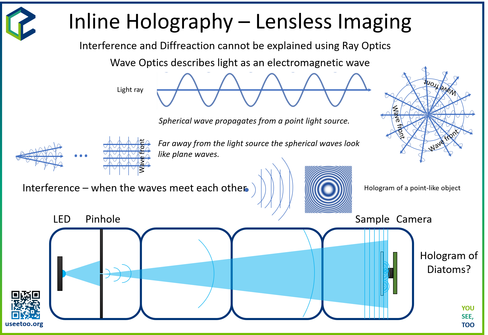
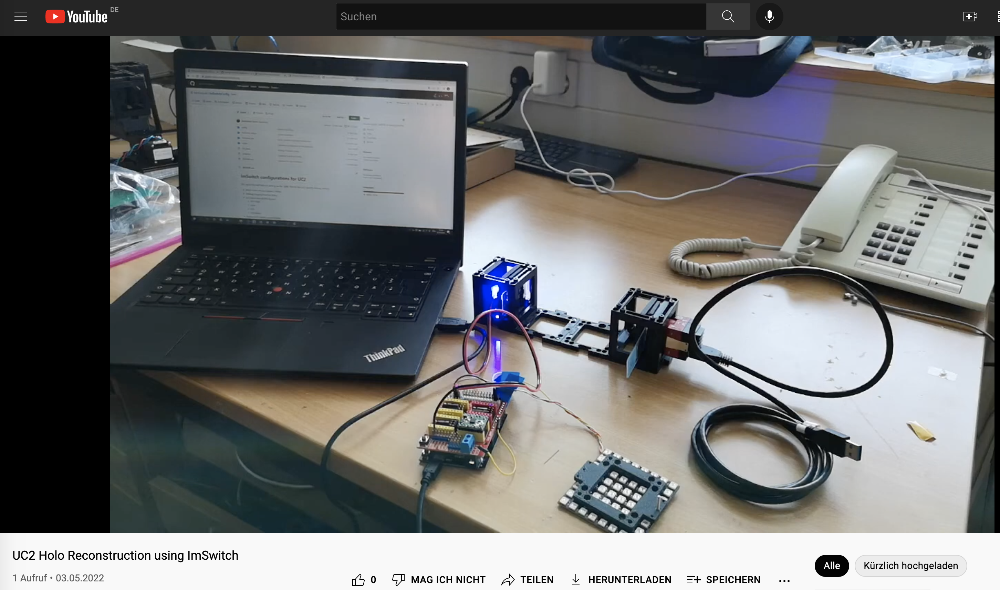

## Experiment 1 - In-Line Holographic Microscope

This experiment is an introduction into the UC2 toolbox and should give you a chance to get familiar with the core-idea of creating simple, but also complex optical setups using the modular system.

Here you are going to learn:

- assemble the cube
- add inserts
- arrange multiple cubes
- lensless imaging

## Resources

* **OLD** an earlier (2019) workshop on this matter can be found [here](https://github.com/openUC2/UC2-GIT/tree/master/WORKSHOP/INLINE-HOLOGRAMM)
* **CAD** the full assembly including the description can be found in the [Assembly](https://github.com/openUC2/UC2-GIT/tree/master/APPLICATIONS/APP_INLINE_HOLOGRAM)-folder
* **SLIDES** for the introduction into holography can be found in the [PRESENTATION](./PRESENTATION/UC2_Holography.pdf)-folder

## Setup

In this course you are going to build/recreate this setup. In the following section you will find a video tutorial with a step-by-step guid how to reproduce the result.

## Assembly

In [this video](https://youtu.be/2P4FSSlXXQA) you will learn how to setup a UC2 system and also how to build the holographic Microscope

## SOFTWARE

***Prerequirements***
Here you will finde a guide how to setup the ImSwitch Software:

- Download the Software package from [Dropbox](https://www.dropbox.com/sh/pea63wifrq3edsl/AAChzXEGA55uUt2Kjxxfk_Dka?dl=0)
- Install Anaconda (*Important:* When you're asked to add Anaconda to the `PATH` environment, say `YES`!)
- Install Arduino + all drivers
- Install the CH340 driver
- Extract `ImSwitch.zip` to `/User/$USER$/Documents/ImSwitch` (clone or download from [GitHub](https://github.com/beniroquai/ImSwitch))
- Extract `ImSwitchConfig.zip` to `/User/$USER$/Documents/ImSwitchConfig` (clone or download from [GitHub](https://github.com/beniroquai/ImSwitchConfig))
- *Optional*: Install Visual Studio Code + the Python plugin => setup the Visual studio code IDE for Python

***Install ImSwitch for UC2***

- Open the anaconda command (Windows + R => "CMD" => enter)
- Type: `conda create -n imswitch`
- Wait until environment is created
- Type: `conda activate imswitch`
- Type: `cd /User/$USER$/Documents/ImSwitch`
- Type: `pip intall -r requirements.txt`
- Type: `pip intall -e ./`
- Type: `imswitch`

## Reconstruction

This video will show you how to reconstruct holographic data using UC2 and ImSwitch.

*Things to explore:*
* Get Familiar with ImSwitch
* Get a sparse sample e.g. plankton on coverslip would be best, or just dust/sand/cheeck cells and try to acquire some holograms

## Protocol

* coming soon

## Problems

- distance between sensor/sample
- stray Light
- sample not sparse enough
