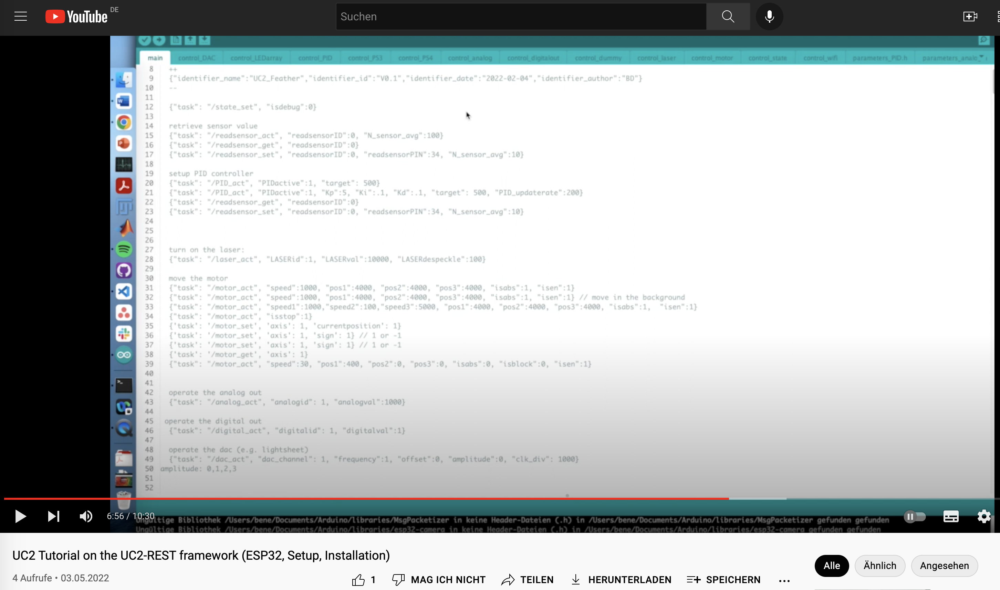
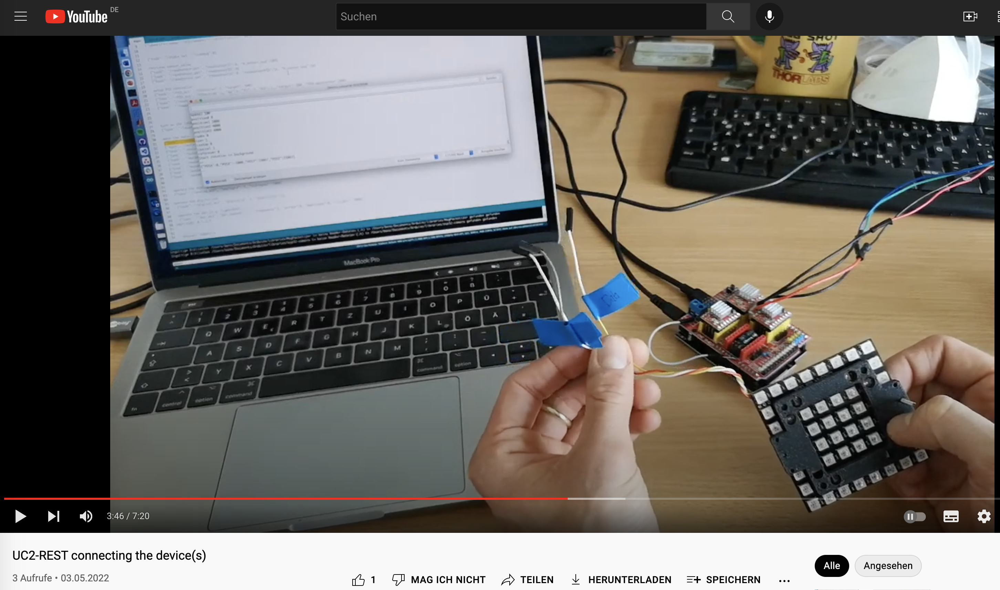

## Tutorial 3 - Introduction into µControllers

Here you learn how to get the UC2-REST firmware running on the ESP32 in order to work with the ImSwitch Software.

## Presentation

The slides for the theoretical introduction can be found in the [Presentation](./PRESENTATION)-folder. 

## Install necessary software for UC2 rest (flash and interact)

Here you learn how to install the necessary software (Arduino IDE, drivers, ESP-IDF, ARduino libraries) that are necessary for the system to be working.

Additional github links that provide you with the latest version of the software:

* https://github.com/openUC2/UC2-REST (=> firmware under ESP32/main; compile and flash on your ESP32 board)
* https://github.com/beniroquai/BenesArduinoLibraries (=> all libraries necessary to compile the software)
* https://learn.sparkfun.com/tutorials/how-to-install-ch340-drivers/all (=> CH340 drivers for the ESP32 board)

We provide a dropbox with all Windows executables that you need to install in order to use UC2:

## Connect devices

Here you learn how to connect the ESP32 to the Arduino IDE, connect external hardware components (e.g. LED matrix) and control the electronics using the USB-serial interface

## Control UC2 devices using Jupyter Notebooks

Please have a look [here](https://github.com/openUC2/UC2-REST/blob/master/README.md#python) for more information including the Jupyter Notebook.

## Control UC2 devices using ImSwitch

Please have a look [here](https://github.com/beniroquai/ImSwitch) for more information about how to install ImSwitch and [here](https://github.com/beniroquai/ImSwitchConfig) for the UC2-related setup files including the UC2-REST serial interface.

