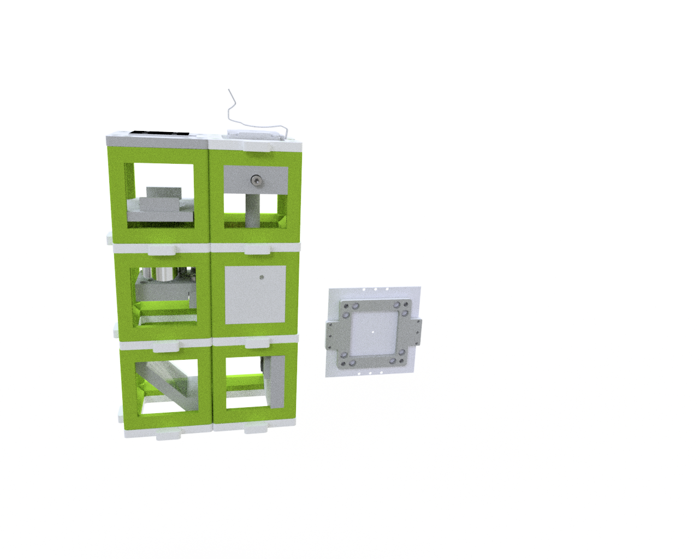

##  Experiment 3 - Build your own incubator microscope

Assemble and setup the incubator microscope.

This experiment sets up a finite-corrected bright-field microscsope that has a motorized Z-stage and an LED array for the illumination.

The microscope is based on the design found [here](../../APPLICATIONS/APP_Incubator_Microscope)

## Setup

This is what you want to build now:

*Ingredients*:

* 1x folding mirror
* 1x Thorcam
* 1x Z-stage (see assembly video on [YouTube](https://youtu.be/veXASTEofMw) and [documentation in GitHub](https://github.com/openUC2/UC2-Zstage/blob/master/README.md#hardware---motor-driven-z-stage-diy-captive-nema11) )
* 1x finite corrected objective lense
* 1x LED array
* 1x sample mount

**IMPORTANT:** Build-the-stage-tutorial comes [here](https://youtu.be/veXASTEofMw)

## Assembly + setup

This [YouTube](https://youtu.be/1GiRtm58fPc)-video gives you a tour through the assembly and setup process.

## Protocol

1. Setup the microscope using one BOX and the description given in the link above
2. Setup ImSwitch with the proper Json file that integrates the UC2-REST and Thorcam
5. Get familiar with basic functions inside the GUI
6. Try to change the LED-Matrix pattern using the customized settings
7. Try to get a focussed microscope image by coarsely aligning the lens and stepping it up-and-down using the GUI
8. Try to set up a time-series using the GUI
9. Place a sample in the tray and study how the contrast varies when the light-source changes

### Long-Time Experiment

Prepare a "living" sample and observe it over-night:
