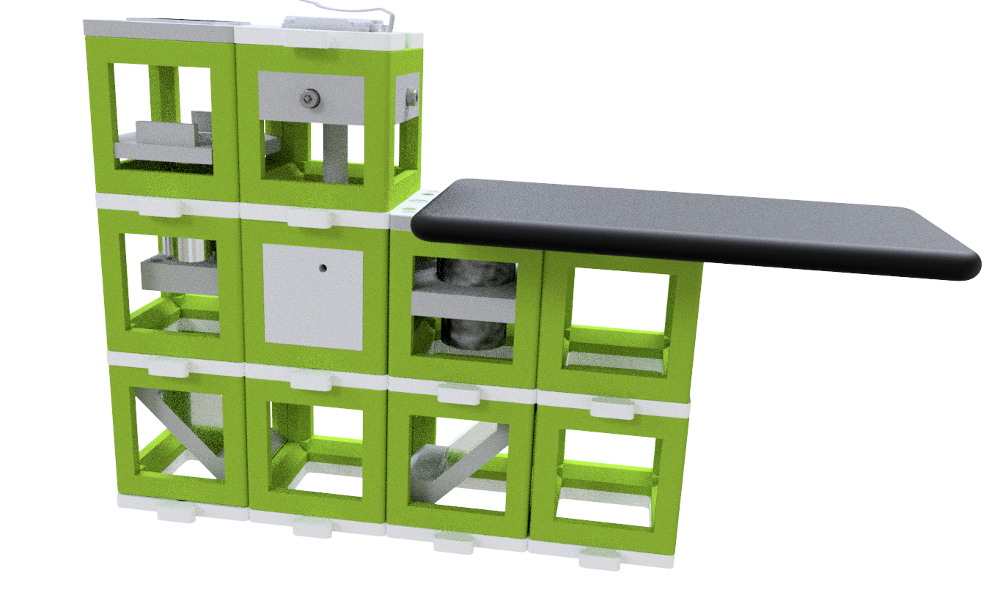

##  Experiment 4 - Build your own Smartphone Microscope

Assemble and setup the smartphone microscope.

This experiment sets up a finite-corrected bright-field microscsope that has a motorized Z-stage and an LED array for the illumination and your cellphone as a detection mechanism.

The microscope is based on the design found [here](https://github.com/openUC2/UC2-GIT/tree/master/APPLICATIONS/APP_SMARTPHONE_MICROSCOPE)

## Setup

This is what you want to build now:

*Ingredients*:

* 2x folding mirror
* 1x eyepiece
* 1x Z-stage (see assembly video on [YouTube](https://youtu.be/veXASTEofMw) and [documentation in GitHub](https://github.com/openUC2/UC2-Zstage/blob/master/README.md#hardware---motor-driven-z-stage-diy-captive-nema11) )
* 1x finite corrected objective lens
* 1x LED array
* 1x sample mount
* several cubes and baseplates

## Assembly + setup

This [YouTube](https://youtu.be/1GiRtm58fPc)-video gives you a tour through the assembly and setup process.

## Tasks

1. Mount a sample on the *Z-Stage*
2. Take a picture
3. Share it with the Twitter community @openUC2 :-)
